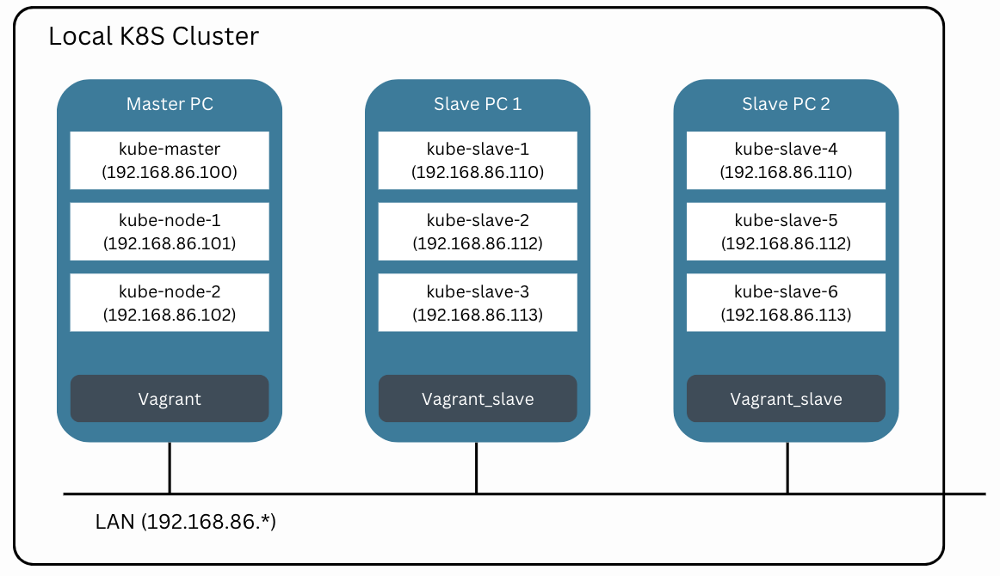

# tz-k8s-vagrant

It supports two version of k8s installation in terraform or local VMs.
to project root directory. 



## -. Features 
```
    -. build a vagrant env
    -. install k8s master and nodes
    -. install dashboard
    -. install monitoring (Prometheus, Grafana)
    -. install jenkins
    -. build a test app(youtoube scrawler) in jenkins
    -. deploy the app to k8s 
    
    -. support AWS with terraform
```

## -. Run VMs with k8s 
``` 
    bash run.sh
    or
    bash run.sh down
``` 

## -. Refer to README.md for each version.
```
    - build a K8S in local vagrant VMs
        vagrant -> VMs -> k8s -> monitoring -> jenkins -> teat-app build
        scripts/local/README.md
    - build a K8S in aws
        vagrant -> terraform -> aws -> k8s -> monitoring -> jenkins -> teat-app build / packer
        scripts/terraform/README.md
```

## * install kubectl in macbook 
### cf) https://kubernetes.io/docs/tasks/tools/install-kubectl/
``` 
    brew install kubectl
    mkdir -p ~/.kube
    cp tz-k8s-vagrant/config ~/.kube/config
    kubectl get nodes
```

